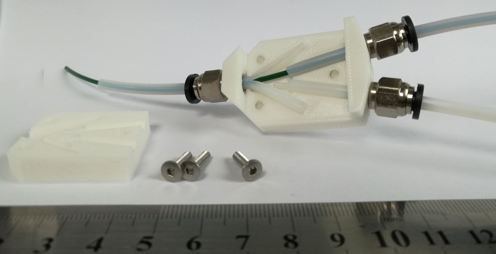
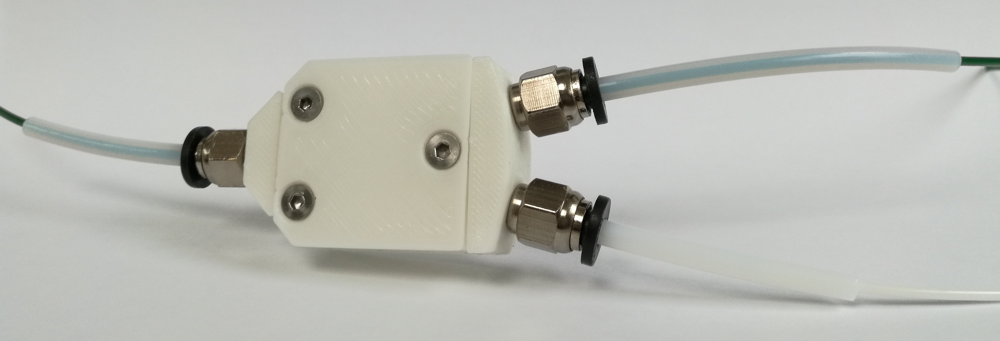
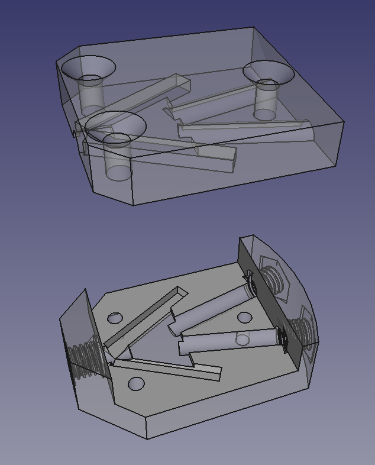

# Filament-Y
A design for a 3D printer filament merging Y for multiple-material RepRaps

This design is based on a wonderfully simple idea from Martin Zeman (see: https://www.thingiverse.com/thing:3039887).  It is easy to print, to construct, and to put together.  In operation it works very smoothly with low friction.

Two input 4mm PTFE Bowden feeds come straight through the pneumatic fittings on the right of the picture (like these: https://reprapltd.com/shop/pneumatic-fitting/ ; make sure you get the ones where the tube goes right through).  You split the end of the output tube down the middle to a depth of 20mm then push it through, guiding the two halves of the split to their retaining slots left and right.  Finally screw the top down with three 12mm M3 countersunk screws.  These self-tap into the base.

Here it is assembled.

The CAD design was done in FreeCAD (https://www.freecadweb.org/).

You can, of course, chain these together to merge as many filament streams as you wish.

This is the first in a set of modular designs that together will form a multi-filament drive system.  The idea is that you will be able to put them together to form a drive system that will be an add on to any system to feed into a single nozzle.  All the system will need to be able to do is to drive one stepper for them all, and send either serial data or a number of parallel bits to give the number of filaments (1 bit: 2 filaments; 2 bits 4 and so on).
